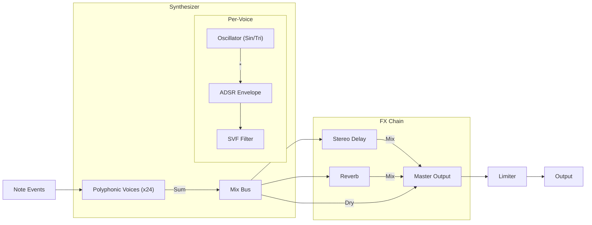
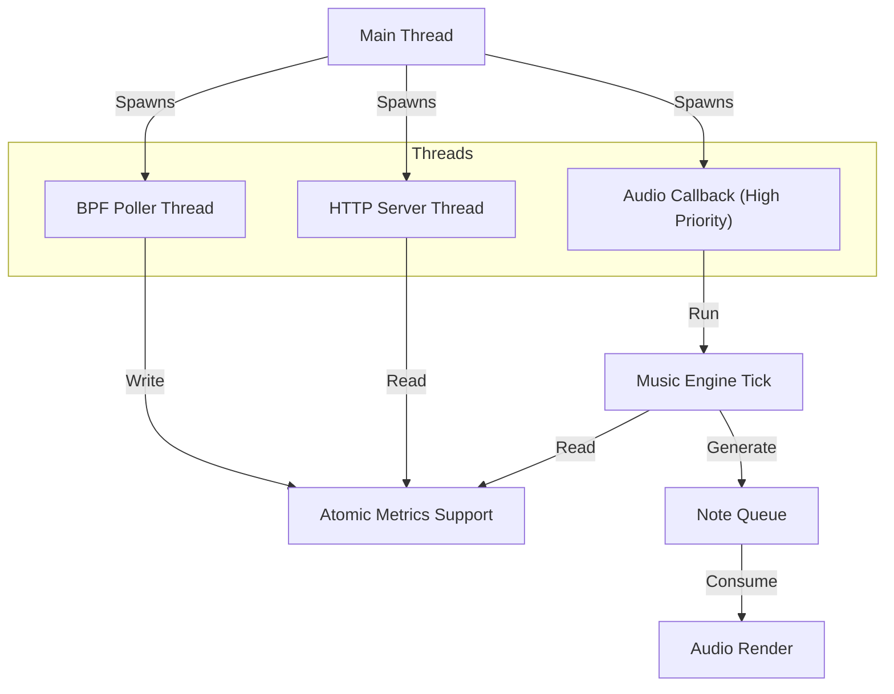

# khor Architecture (v1.0)

## High-Level Dataflow

1. **eBPF probes** (kernel tracepoints) collect low-level activity.
2. **Userspace collector** consumes ring buffer events and maintains rolling metrics (rates + history).
3. **Signal pipeline** normalizes and smooths metrics into stable `[0..1]` control signals.
4. **Music engine** maps control signals into musical events (notes + continuous parameters).
5. **Outputs**
   - **Audio** (miniaudio) renders notes locally.
   - **MIDI** (ALSA sequencer, optional) sends note/CC events to external synths/DAWs.
   - **OSC** (UDP, optional) sends messages to creative tooling (TouchDesigner, etc).
6. **HTTP server** exposes status, metrics, configuration, and a streaming endpoint; also serves the UI bundle.
7. **UI** shows status + charts + presets and writes config changes back to the daemon.

## Audio Signal Flow

## Components (Source Layout)

- `bpf/`
  - `khor.bpf.c`: CO-RE eBPF programs and maps
  - `khor.h`: shared event/config types used by both BPF and userspace
- `daemon/`
  - `src/`: daemon implementation (collector, signal pipeline, engines, HTTP)
  - `include/`: public-ish internal headers (small stable surface)
  - `third_party/`: single-header deps fetched by script (not committed)
- `ui/`
  - Vite + React UI
- `scripts/`
  - build/run helpers and installer

## Threading Model

- **Main thread**: process lifecycle + configuration + BPF setup/teardown.
- **BPF thread**: polls ringbuf, updates metrics/history.
- **Music thread**: runs a quantized clock, maps signals -> note events.
- **Audio callback thread**: real-time audio; must not lock.
- **HTTP thread**: serves API + UI + SSE stream.

Real-time safety rule: the audio callback must only read from lock-free structures (SPSC queue, atomics).

## Security / Privilege Model

- Default runtime is a **user process**.
- eBPF requires capabilities:
  - recommended: one-time `setcap cap_bpf,cap_perfmon,cap_sys_resource+ep khor-daemon`
- HTTP binds to `127.0.0.1` by default.

## Configuration

- Config file location: `$XDG_CONFIG_HOME/khor/config.json` (fallback `~/.config/khor/config.json`).
- Runtime config can be updated via HTTP API; changes are persisted.

## UI Serving

- Production UI is served as static files from a configured `--ui-dir` (default install location).
- Dev mode can run `ui` via Vite separately; the UI can point at a different API base.
