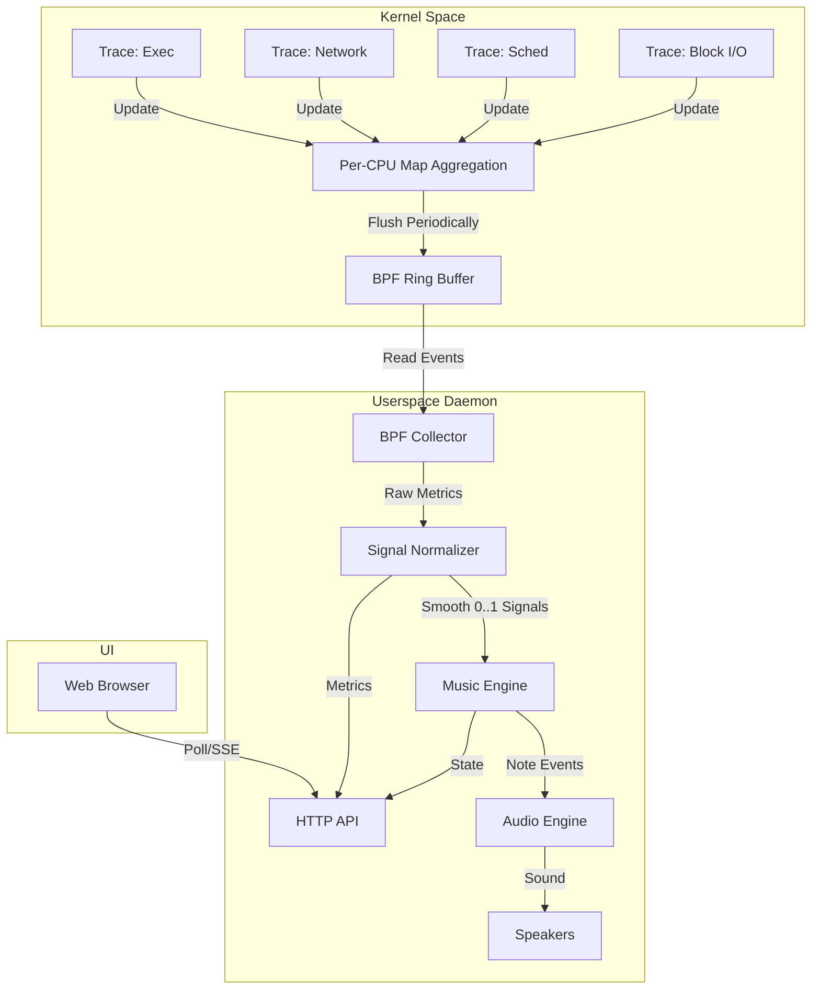

# khor

Khor (or kernel choir) turns kernel activity into music on **native Linux**:

- eBPF collectors aggregate low-overhead system metrics (exec/network/sched/block)
- a deterministic music engine maps signals to notes + synth parameters
- audio plays locally (miniaudio via PulseAudio/PipeWire or ALSA)
- optional outputs: **OSC (UDP)** and **MIDI (ALSA sequencer)**
- a built-in web UI shows status, charts, presets, and live control

This repo targets Linux as the primary platform. Root is **not** the normal run mode: use a one-time `setcap` for eBPF.


See `ARCHITECTURE.md` for the detailed dataflow.

## Core Concepts

1.  **eBPF Probes (The Ears)**: Traces `execve` (programs starting), `net_dev_queue` (network traffic), `sched_switch` (context switches), and `block_rq_issue` (disk I/O).
2.  **Signal Pipeline (The Brain)**: Normalizes raw event counts into `0.0` to `1.0` control signals using logarithmic scaling and exponential smoothing.
3.  **Music Engine (The Composer)**: A step sequencer that deterministically generates music based on these signals.
4.  **Audio Engine (The Voice)**: A custom polyphonic synthesizer (subtractive synthesis, ADSR, delay/reverb).

## High-Level Architecture



## Quick Start (From Source)

### 1) System Dependencies

Ubuntu/Debian:

```bash
sudo apt-get update
sudo apt-get install -y \
  build-essential cmake pkg-config curl \
  clang llvm bpftool libbpf-dev linux-headers-$(uname -r) \
  libcap2-bin
```

Fedora:

```bash
sudo dnf install -y \
  gcc gcc-c++ make cmake pkgconf-pkg-config curl \
  clang llvm bpftool libbpf-devel \
  libcap
```

Optional (MIDI output via ALSA sequencer):

- Ubuntu/Debian: `sudo apt-get install -y libasound2-dev`
- Fedora: `sudo dnf install -y alsa-lib-devel`

### 2) Check eBPF Support

```bash
./scripts/linux-check.sh
```

You want `/sys/kernel/btf/vmlinux` present for CO-RE builds.

### 3) Fetch Single-Header Deps (miniaudio + httplib)

```bash
./scripts/fetch_deps.sh
```

### 4) Build

```bash
./scripts/linux-build.sh
```

### 5) Build UI + Run (Dev)

To serve the UI directly from the daemon in dev:

```bash
npm --prefix ui ci
npm --prefix ui run build
./scripts/linux-run.sh --ui-dir ui/dist
```

Open `http://127.0.0.1:17321`.

Alternative UI dev server (hot reload):

```bash
./scripts/linux-run.sh --no-audio --no-bpf
npm --prefix ui run dev
```

Set `VITE_API_BASE` if your daemon is not on the default address/port.

## Install (User Daemon + UI + systemd --user)

```bash
./scripts/install.sh
```

Enable eBPF without sudo/root runtime (one-time):

```bash
sudo setcap cap_bpf,cap_perfmon,cap_sys_resource+ep ~/.local/bin/khor-daemon
getcap ~/.local/bin/khor-daemon
```

Start on login:

```bash
systemctl --user daemon-reload
systemctl --user enable --now khor.service
```

Open `http://127.0.0.1:17321`.

Uninstall:

```bash
./scripts/uninstall.sh
```

## Runtime Notes

### Audio

- Do not run the daemon as root if you expect desktop audio. PipeWire/Pulse are per-user services.
- If you must run with elevated privileges for eBPF, prefer the one-time `setcap` above.
- Use the UI "Outputs" section to pick a playback device and adjust master gain.
- Debug backends:
  - force ALSA: `KHOR_AUDIO_BACKEND=alsa ./scripts/linux-run.sh`
  - force Pulse: `KHOR_AUDIO_BACKEND=pulse ./scripts/linux-run.sh`

### eBPF Permissions

If `/api/health` shows `BPF disabled: EPERM` (or similar):

1. Verify the binary has caps: `getcap ~/.local/bin/khor-daemon`
2. Ensure your kernel supports `CAP_BPF`/`CAP_PERFMON` (older kernels may require root)
3. For libbpf debug logs: `KHOR_DEBUG_LIBBPF=1 ./scripts/linux-run.sh`

Fake mode is off by default. Enable it explicitly:

```bash
./scripts/linux-run.sh --fake --no-bpf
```

## Configuration

Default config path:

- `${XDG_CONFIG_HOME:-~/.config}/khor/config.json`

The UI edits config via `PUT /api/config`, and the daemon persists it to that file.

Key fields:

- `listen.host` / `listen.port`
- `ui.serve` / `ui.dir`
- `features.bpf` / `features.audio` / `features.midi` / `features.osc` / `features.fake`
- `music.*` (bpm, key, scale, preset, density, smoothing)
- `audio.*` (backend, device, sample_rate, master_gain)
- `midi.*` (port, channel)
- `osc.*` (host, port)
- `bpf.*` (enabled_mask, sample_interval_ms, tgid_allow, tgid_deny, cgroup_id)

## CLI

```bash
~/.local/bin/khor-daemon --help
```

Common flags:

- `--config PATH`
- `--listen HOST:PORT`
- `--ui-dir PATH`
- `--no-bpf`, `--no-audio`
- `--midi`, `--osc`
- `--fake`

## HTTP API (v1)

All APIs are same-origin under `/api/*`.

- `GET /api/health`
- `GET /api/metrics`
- `GET /api/config`
- `PUT /api/config` (partial patch supported)
- `GET /api/presets`
- `POST /api/preset/select?name=ambient|percussive|arp|drone`
- `GET /api/audio/devices`
- `POST /api/audio/device` (JSON body: `{"device":"id:<hex>"}` or `{"device":""}` for default)
- `POST /api/actions/test_note`
- `GET /api/stream` (SSE, ~10Hz)

Examples:

```bash
curl -s http://127.0.0.1:17321/api/health | jq .
curl -s http://127.0.0.1:17321/api/metrics | jq .
curl -s http://127.0.0.1:17321/api/presets | jq .
curl -s -X POST 'http://127.0.0.1:17321/api/actions/test_note?midi=62&vel=0.7&dur=0.3'
```

## MIDI (Optional)

MIDI output uses the ALSA sequencer and requires headers/libs at **build time**.

On Fedora:

```bash
sudo dnf install -y alsa-lib-devel
./scripts/linux-build.sh
./scripts/linux-run.sh --midi
```

Then connect the virtual port to a synth:

```bash
aconnect -l
```

## OSC (Optional)

Enable OSC:

```bash
./scripts/linux-run.sh --osc
```

Default target is `127.0.0.1:9000` (configurable).

Messages:

- `/khor/note` `(int midi, float vel, float dur)`
- `/khor/signal` `(string name, float value01)`
- `/khor/metrics` `(float exec_s, float rx_kbs, float tx_kbs, float csw_s, float blk_r_kbs, float blk_w_kbs)`

## Tests

```bash
./scripts/linux-build.sh
cd daemon/build
ctest --output-on-failure
```

## License

Project license: see `LICENSE`.

Third-party notices: see `THIRD_PARTY_NOTICES.md`.

